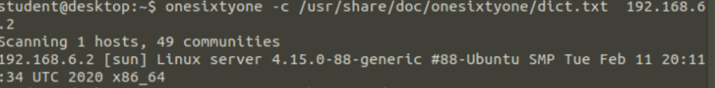

#### CTFname:
CyberSpike
#### Challenge name: 
Grasshopper
#### Challenge description:
_Dave the IT guy works at a company and configured his own nc (netcat) communication method for the employees 
to connect to company servers with instead of using SSH, which Dave strongly dislikes._

The challenge is separated into 4 parts:
- Foothold
- Brute-force community string
- Brute forcing the community string to gain acces.
- Remote Access
- Enumerate the SNMP server and look for any potentially sensitive information’ : Find your way into the server and retrieve the flag.
- Lateral movement
#### Challenge category: 
Linux, networks, tooling, scanning & enumeration
#### Challenge points: 
unknown (Medium difficulty)
#### Estimated time 
45 minutes – 4 hours maximum duration
#### Year and date: 
march 5 th 2020
#### TL;DR (The challenge is named Grasshopper – going from node to node)
_The goal is to gain access the company server by gathering information about SNMP, brute forcing
the community string to gather information about credentials. Use the community string to retrieve
a file including information about the configured SNMP protocol and password. The password is
used to log in to the server. A final password in order to connect to the **second server** is stored in
`remote-access-terminal.sh`, located on the **first server**._

**Note:**

The challenge has 4 nodes available: Two servers, a computer and router.
Tools and technical adjustments will be saved on the system **during the 4 hour time window of the
challenge. Various keys, passwords, etc. do not. They will change after ‘stop all’.**

**Prerequisites – can be installed on the provided machines:**
- `Python` (for running various tools)
- `Python Pip`
- `Nmap`
- `snmp-check` https://tools.kali.org/information-gathering/snmp-check
> Ruby is used to run this tool. At the time of the challenge (5 th March 2020) snmp-check
> cannot be retrieved from the official Kali repositories. Installing and configuring with
> python is also not a viable option.
- `snmpwalk`
- `onesixtyone`
- Knowledge about SNMP
- Community strings
- versions of the protocol (V1,V2 and V3): It’s features and weaknesses.
- Ports used (161,162, 8686).

First off is to check whether any ports are open and what services active on the ports.

Nmap is used, starting with the `-sP` (stealthy ping) to scan for any live systems. 
After that `-sV` is used for version detection.
Results point out that port 161 and 162 are opened. 162 is not relevant for this challenge.
SNMP uses UDP to transfer data:

`nmap <server ip> -Pn -sU -p 161 -sV`

**onesixty one**

Is used to brute-force the communitystring. This is done easily by using a dictionary that comes
with the tool, located at `/usr/share/doc/onesixtyone/`
Bruteforcing the community string using:
`onesixtyone -c /usr/share/doc/onesixtyone/dict.txt <server address>`

‘`[sun]`’ is the community string.

**snmpwalk**

Now we’ve got the communitystring we can test it with `snmpwalk`. If its correct ([sun] in this case)
then it shows the output containing the password for the first server:
`snmpwalk -v 2c -c <communitystring> <server address>`
used:
`snmpwalk -v 2c -c sun 192.168.6.2`


As shown snmpwalk has no output when an invalid communitystring is used.

The next step is to find an example in order to know what to look for in the file when using
snmpcheck: https://www.nothink.org/codes/snmpcheck/snmpcheck-1.8.pl

**snmpcheck**

snmpwalk verified a legit communitystring on an available SNMP service running on the server.
Snmpcheck is next to gather information about the SNMP configuration.

command used:
`ruby snmpcheck.rb <server address> -c <communitystring >| less`
In this case:
`ruby snmpcheck.rb 192.168.6.2-c sun | less`
giving output:


Revealing that the password is saved within the data which in turn is used to log in to the server.

**Nc** to `<server address>` using port 8686 in order to connect, use the password found using
the snmpcheck-tool to log in.
  
_Given the fact that the communitystring is [sun], it’s perhaps a hint. ‘sun’ associated with SNMP is
port 8686 – known for Sun App Server – used with netcat together with the server address._
https://www.speedguide.net/port.php?port=8686


**The terminal of each server have no output**, that is why `echo` <string> is used after a command to check whether it is done executing.
The last password in order to connect to the second server is located in the ```remote-access-terminal.sh``` file.
